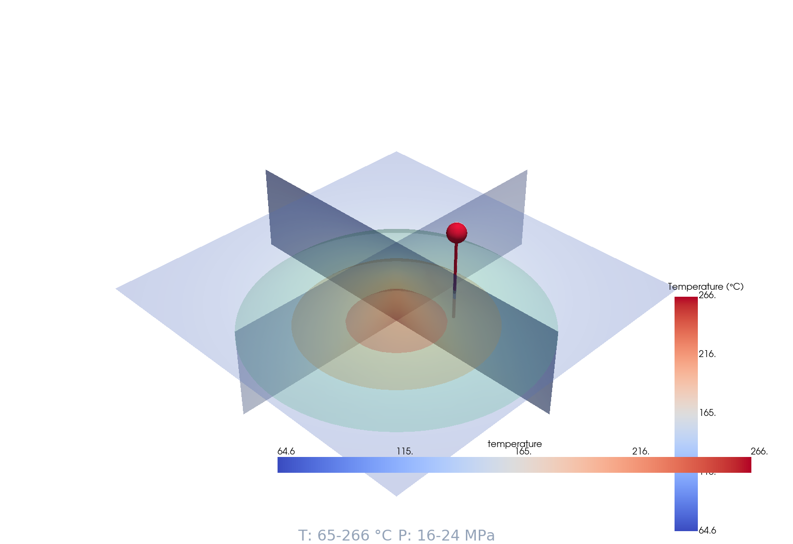

# GARUDA

## Geothermal And Reservoir Understanding with Data-driven Analytics

[](https://github.com/zakusworo/garuda/actions)
[](https://www.python.org/downloads/)
[](https://github.com/zakusworo/garuda/actions/workflows/ci.yml)
[](./htmlcov)
[](https://opensource.org/licenses/MIT)
[](https://indonesia.id)

```
╔═══════════════════════════════════════════════════════════════╗
║   GARUDA - Geothermal And Reservoir Understanding            ║
║          with Data-driven Analytics                          ║
║                                                              ║
║          🇮🇩  Powered by Indonesia  🇮🇩                       ║
╚═══════════════════════════════════════════════════════════════╝
```

**Acronym:** **G**eothermal **A**nd **R**eservoir **U**nderstanding + **D**ata-driven **A**nalytics  

**GARUDA** is a modern, open-source reservoir simulator for **petroleum** and **geothermal** energy systems, with special focus on Indonesian volcanic geothermal resources and AI/ML integration.

> Named after **Garuda**, the mythical bird king of Indonesian mythology - representing speed, power, and vision in energy simulation.

---

## Features

### Core Capabilities
- ✅ **Single-phase flow** with TPFA (Two-Point Flux Approximation)
- ✅ **Non-isothermal flow** for geothermal applications
- ✅ **IAPWS-IF97** thermophysical properties — saturation pressure, density, viscosity, enthalpy, specific heat, thermal conductivity
- ✅ **Well models** — pressure-constrained (BHP) or rate-constrained wells with automatic switching
- ✅ **Structured grids** (1D, 2D, 3D Cartesian) with heterogeneous permeability and porosity
- ✅ **Numba-accelerated** solvers for performance
- ✅ **Pure Python** implementation (no C++ compilation needed)
- ✅ **550+ unit & integration tests** with pytest and coverage reporting

### Geothermal Extensions
- 🌡️ Temperature-dependent fluid properties (IAPWS-IF97 water/steam)
- 🔥 Coupled heat transport (conduction + convection)
- 💧 **Source networks** — Waiwera-inspired producers, injectors, separators, reinjectors, and source groups
- 🪨 **Dual-porosity / MINC** — Warren-Root, Kazemi, Lim-Aguilera shape factors with PSS & transient transfer
- 💧 **Relative permeability** — Corey, van Genuchten-Mualem, Linear, and Stone I models
- 💧 **Capillary pressure** — Brooks-Corey and van Genuchten models
- 🧊 **Region-based thermodynamics** — water (IF97 Region 1), steam (Region 2), supercritical, and saturation curve interpolation
- 🌋 Indonesian geothermal reservoir templates (volcanic, high-T)

### Petroleum Extensions
- 🛢️ Single-phase oil/gas (currently) with extension points for black-oil/compositional
- ⛽ Compositional modeling (planned)
- 📊 History matching tools (planned)
- 🎯 Well optimization (planned)

### Interactive 3D Visualization
- 🧊 **3D Reservoir Visualizer** — isothermal surfaces, cross-section slices, flow streamlines, well trajectories, pressure drawdown
- 🖼️ **PNG/VTK export** — screenshots for papers, VTK for ParaView post-processing
- 🎛️ **Live-configurable** — grid size, temperatures, well position, drawdown, all toggled interactively
- 🖥️ **PETSc backend** — distributed-memory KSP linear solvers (CG, GMRES, BiCGSTAB) with AMG preconditioning (GAMG, hypre)
- 🖥️ **DMDA distributed mesh** — ghost-cell exchange for structured grids on multi-node clusters
- 🖥️ **SNES non-linear solver** — Newton-Krylov for coupled multiphase systems

> PETSc solver is optional.  GARUDA ships with a pure Python fallback
> (`TPFASolver` via SciPy).  Install PETSc for million-cell simulations.

---

## Installation

```bash
# Clone the repository
git clone https://github.com/zakusworo/garuda.git
cd garuda

# Create and activate virtual environment
python -m venv .venv
source .venv/bin/activate  # On Windows: .venv\Scripts\activate

# Install in development mode
pip install -e ".[dev]"

# Optional: ML capabilities
pip install -e ".[ml]"

# Optional: GPU acceleration
pip install -e ".[gpu]"

# Optional: HPC / Scalable Solvers (PETSc)
pip install -e ".[petsc]"
```

### PETSc Installation (System Dependency)

`petsc4py` is a Python wrapper around PETSc, which must be installed at the
system level first:

**Ubuntu / Debian**

```bash
sudo apt-get update
sudo apt-get install petsc-dev libpetsc-real-dev
pip install petsc4py
```

**macOS (Homebrew)**

```bash
brew install petsc
pip install petsc4py
```

**Build from source (for AMG / hypre)**

```bash
# Download PETSc from https://petsc.org/release/download/
# Configure with algebraic multigrid (recommended for reservoir simulations)
python configure \
  --with-fc=0 \
  --download-f2blaslapack \
  --download-hypre \
  --download-metis \
  --download-parmetis
make PETSC_DIR=/path/to/petsc PETSC_ARCH=arch-linux all
pip install petsc4py
```

> For best performance, always configure PETSc with `--download-hypre`
> to enable hypre-BoomerAMG preconditioning for heterogeneous permeability fields.

### Requirements
- Python 3.10+
- NumPy ≥ 1.20
- SciPy ≥ 1.7
- Numba ≥ 0.56

---

## Quick Start

### 1D Single-Phase Flow

```python
from garuda import StructuredGrid, TPFASolver
import numpy as np

# Create a 1D grid (10 cells, 100 m each, 10x10 m² cross-section)
grid = StructuredGrid(nx=10, ny=1, nz=1, dx=100.0, dy=10.0, dz=10.0)

# Set rock properties
grid.set_porosity(0.2)
grid.set_permeability(100, unit='md')  # 100 millidarcy

# Create TPFA solver
solver = TPFASolver(grid, mu=1e-3, rho=998.0)

# Define boundary conditions (Dirichlet: p_left=200 bar, p_right=100 bar)
bc_values = np.array([200e5, 100e5])  # Pa

# Solve for pressure
pressure = solver.solve(
    source_terms=np.zeros(grid.num_cells),
    bc_values=bc_values,
)

print(f"Pressure range: {pressure.min()/1e5:.1f} - {pressure.max()/1e5:.1f} bar")
```

### Well Model (BHP or Rate Constraint)

```python
from garuda.physics.well_models import (
    PeacemanWell, WellParameters, WellOperatingConditions
)

# Define well parameters
params = WellParameters(
    name="PROD-1",
    cell_index=4,      # completed in cell 4
    well_radius=0.1,   # wellbore radius [m]
    skin_factor=0.0,   # skin factor
    well_depth=1000.0,
)

# Define operating conditions
ops = WellOperatingConditions(
    constraint_type="pressure",  # or "rate"
    target_value=150e5,          # BHP target [Pa]
    max_rate=50.0,               # max rate limit [kg/s]
    min_bhp=80e5,                # shut-in below this [Pa]
)

# Create the well
well = PeacemanWell(params, ops)

# During simulation — compute flow rate [kg/s]
rate, bhp = well.compute_rate(
    cell_pressure=200e5,       # current cell pressure [Pa]
    wellbore_pressure=150e5,   # BHP [Pa]
    density=780.0,             # kg/m³
)
print(f"Well rate: {rate:.2f} kg/s, BHP: {bhp/1e5:.1f} bar")
```

### IAPWS-IF97 Thermophysical Properties

```python
from garuda.core.iapws_properties import IAPWSFluidProperties

props = IAPWSFluidProperties()

# Single properties (pressure in Pa, temperature in K)
rho = props.get_density(p=15e6, T=550.0)   # Pa, K → kg/m³
mu  = props.get_viscosity(p=15e6, T=550.0)  # Pa, K → Pa·s
h   = props.get_enthalpy(p=15e6, T=550.0)  # Pa, K → kJ/kg

# Get all properties at once
all_props = props.get_all(p=1e6, T=293.15)  # 1 MPa, 20°C
# → {
#     'density': ...,          # kg/m³
#     'viscosity': ...,        # Pa·s
#     'enthalpy': ...,         # kJ/kg
#     'specific_heat_cp': ..., # kJ/(kg·K)
#     'thermal_conductivity': ...,  # W/(m·K)
# }
```

### Geothermal Simulation (Non-Isothermal)

```python
from garuda.core.grid import StructuredGrid
from garuda.core.iapws_properties import IAPWSFluidProperties
from garuda.physics.thermal import ThermalFlow
from garuda.core.rock_properties import RockProperties
import numpy as np

# 3D reservoir grid
grid = StructuredGrid(nx=20, ny=20, nz=10, dx=50.0, dy=50.0, dz=20.0)

# Indonesian volcanic reservoir rock
rock = RockProperties(
    porosity=0.12,
    permeability=150.0,       # md
    permeability_unit='md',
    lambda_rock=2.5,          # W/(m·K) thermal conductivity
    cp=840.0,                 # J/(kg·K)
)
grid.set_porosity(rock.porosity)
grid.set_permeability(rock.permeability_m2)

# Geothermal fluid + thermal model
fluid = IAPWSFluidProperties()
thermal = ThermalFlow(grid, rock, fluid)

# Geothermal gradient initialization (30 °C/km)
T_init = thermal.compute_geothermal_gradient(
    surface_temp=298.15,   # 25 °C
    gradient=0.03,         # 30 °C/km
)

# Injection well (positive rate = injector)
source_terms = np.zeros(grid.num_cells)
source_terms[grid.num_cells // 2] = 50.0   # 50 kg/s injection

# Time-stepping with coupled flow + heat transport
solver = TPFASolver(grid, mu=1e-3, rho=998.0)
dt = 3600  # 1 hour
for step in range(100):
    result = thermal.step_coupled(
        dt=dt,
        source_terms=source_terms,
        heat_sources=np.zeros(grid.num_cells),
        bc_type='dirichlet',
        bc_values={'pressure': np.array([250e5, 250e5])},
        flow_solver=solver,
    )

    if step % 10 == 0:
        print(f"Step {step}: T_max={thermal.temperature.max()-273.15:.1f}°C")
```
>
> Note: The non-isothermal solver is actively developed. For stable single-phase flow,
> use `TPFASolver` directly (see 1D example above).

---

### PETSc Large-Scale Solver (Optional)

```python
from garuda import StructuredGrid
from garuda.solvers import PETScTPFASolver, has_petsc

if not has_petsc:
    raise RuntimeError("Install PETSc backend: pip install petsc4py")

# 100 × 100 × 20 grid = 200,000 cells
grid = StructuredGrid(nx=100, ny=100, nz=20, dx=10.0, dy=10.0, dz=5.0)
grid.set_permeability(1e-14)  # m²
grid.set_porosity(0.2)

solver = PETScTPFASolver(
    grid,
    solver_type="gmres",
    pc_type="gamg",  # algebraic multigrid — ideal for heterogeneous fields
    tol=1e-12,
)

# Run in parallel: mpirun -np 8 python run_sim.py
source = np.zeros(grid.num_cells)
pressure = solver.solve(source, bc_type="dirichlet", bc_values=np.array([250e5, 100e5]))

print(f"Min pressure : {pressure.min()/1e5:.1f} bar")
print(f"Max pressure : {pressure.max()/1e5:.1f} bar")
print(f"Solver config: {solver.get_solver_info()}")
solver.destroy()
```

---

## Heterogeneous Permeability

```python
# Channelized (fractured) permeability field
rock = RockProperties()
rock.set_channelized_permeability(
    nx=50, ny=50, nz=10,
    channel_orientation='x',
    channel_fraction=0.2,     # 20% of grid is high-perm channel
    k_channel=1000.0,         # md
    k_background=10.0,        # md
)
grid.set_permeability(rock.permeability_m2)

# Or Gaussian random field (synthetic geology)
rock.set_gaussian_permeability(nx=50, ny=50, mean=100.0, std=30.0)
grid.set_permeability(rock.permeability_m2)
```

---

## Run the Demos

```bash
# 1D single-phase flow demo
python demo.py

# Geothermal field simulation (Indonesian volcanic reservoir)
python demo_geothermal.py
```

> These standalone demos work with NumPy only — no heavy dependencies needed.

---

## 3D Reservoir Visualizer

Launch the interactive Streamlit GUI for real-time 3D visualization:

```bash
streamlit run garuda_gui.py
```

Then open **🧊 3D Visualizer** from the sidebar.

| Feature | Description |
|---------|-------------|
| **Isothermal Surfaces** | Render 3D temperature contour shells (e.g. 150°C, 200°C) — ideal for visualizing free convection plumes |
| **Cross-Section Slices** | X/Y/Z orthogonal slice planes showing the interior temperature field |
| **Flow Streamlines** | Darcy-velocity pathlines from injection seeds to the production well |
| **Well Trajectory** | Red tube trajectory with spherical wellhead marker |
| **Pressure Drawdown** | Configurable pressure drop (MPa) around the well |
| **Live Config** | Grid size (up to 80×80×40), surface/bottom temperatures, well position — all adjustable |

**Export**
- **PNG** — one-click screenshot for papers and presentations
- **VTK** — opens in ParaView for further post-processing

> Powered by **PyVista** (VTK) off-screen rendering → PNG displayed in Streamlit. First render takes ~5–10s; subsequent renders are cached.

### Example Output



> *3D temperature field (64–266 °C) with isothermal contour shells, X/Y/Z slice planes, production well trajectory, and pressure-drawdown field at 24 MPa max pressure.*

---

## Architecture

```
garuda/
├── garuda/
│   ├── core/
│   │   ├── grid.py              # Structured Cartesian grids (1D/2D/3D)
│   │   ├── tpfa_solver.py       # TPFA finite volume solver (Numba JIT)
│   │   ├── fluid_properties.py  # Basic PVT properties
│   │   ├── iapws_properties.py  # IAPWS-IF97 water/steam properties
│   │   ├── rock_properties.py   # Permeability, porosity, thermal
│   │   ├── source_network.py    # Waiwera-inspired producers, injectors, separators, reinjectors
│   │   ├── dual_porosity.py    # MINC dual-porosity (Warren-Root, Kazemi, Lim-Aguilera)
│   │   └── region_thermodynamics.py  # Region-based EOS (water, steam, supercritical)
│   ├── physics/
│   │   ├── single_phase.py      # Single-phase mass conservation
│   │   ├── thermal.py           # Coupled non-isothermal flow
│   │   ├── well_models.py       # BHP/rate-constrained well models
│   │   ├── relative_permeability.py  # Corey, van Genuchten, Linear, Stone I
│   │   └── capillary_pressure.py     # Brooks-Corey, van Genuchten
│   ├── ml/                      # (Planned)
│   │   ├── upscaling_cnn.py     # ML permeability upscaling
│   │   └── surrogate_model.py   # Neural network emulator
│   ├── agents/                  # (Planned)
│   │   └── integration.py       # Multi-agent AI assistant
│   └── utils/
│       └── visualization.py     # Plotting utilities
├── examples/
├── tests/                       # 50+ unit & integration tests
├── docs/
└── pyproject.toml
```

---

## Roadmap

### Phase 1: Core Development ✅ (v0.1.0)
- [x] Modern Python packaging (pyproject.toml)
- [x] Pure Python TPFA solver
- [x] Structured grid generation (1D/2D/3D, heterogeneous)
- [x] Basic single-phase flow
- [x] **IAPWS-IF97** water/steam properties
- [x] **Well models** (BHP + rate constraints)
- [x] Thermal flow module
- [x] **50+ unit and integration tests**
- [x] 2D/3D solver completion (Numba-accelerated TPFA, verified)
- [x] Documentation (Sphinx + RTD theme, API autodoc ready)

### Phase 2: Domain Extensions ✅ (v0.2.0)
- [x] Multiphase flow (water/steam two-phase for geothermal)
- [x] Source networks — Waiwera-inspired producers, injectors, separators, reinjectors
- [x] Dual-porosity / MINC — Warren-Root, Kazemi, Lim-Aguilera with shape factors
- [x] Relative permeability — Corey, van Genuchten, Linear, Stone I
- [x] Capillary pressure — Brooks-Corey, van Genuchten
- [x] Region-based thermodynamics — IF97 Region 1/2, supercritical, saturation curve
- [ ] Black oil model (petroleum)
- [ ] History matching tools
- [ ] TOUGH2 comparison benchmarks

### Phase 3: AI/ML Integration
- [ ] CNN for permeability upscaling
- [ ] Neural surrogate models
- [ ] Bayesian parameter inversion
- [ ] RL for well optimization
- [ ] Ollama LLM multi-agent assistant

---

## Comparison with Other Simulators

| Feature | GARUDA | TOUGH2 | MRST | tNavigator |
|---------|--------|--------|------|------------|
| **License** | MIT (Open) | Proprietary | GPL | Proprietary |
| **Cost** | Free | $50k+ | Free | $100k+ |
| **Language** | Python | Fortran | MATLAB | C++ |
| **Geothermal** | ✅ Yes | ✅ Yes | ⚠️ Limited | ⚠️ Limited |
| **Petroleum** | 🔄 Single-phase | ✅ Yes | ✅ Yes | ✅ Yes |
| **AI/ML** | ✅ Planned | ❌ No | ⚠️ Basic | ⚠️ Basic |
| **Indonesian Focus** | ✅ Yes | ❌ No | ❌ No | ❌ No |
| **Installation** | `pip install -e .` | Manual | MATLAB req. | Installer |

---

## Contributing

Contributions welcome! Areas needing help:

1. ~~Test suite~~ ✓ — 550+ tests, 89% coverage
2. **Multiphase flow solver** — Couple new rel-perm/pc models into TPFA
3. **Black oil model** — Petroleum compositional simulation
4. **ML integration** — Build surrogate models and upscaling CNN
5. **Multi-agent AI assistant** — LLM-powered reservoir simulation agent

### Development Setup

```bash
# Fork and clone
git clone https://github.com/zakusworo/garuda.git
cd garuda

# Install dev dependencies
pip install -e ".[dev]"

# Run tests
pytest tests/ -v

# Run tests with coverage
pytest tests/ --cov=garuda --cov-report=html

# Lint
ruff check garuda/
black garuda/
```

---

## Citation

If you use GARUDA in your research, please cite:

```bibtex
@software{garuda2026,
  author = {Kusworo, Zulfikar Aji},
  title = {GARUDA: Geothermal And Reservoir Understanding with Data-driven Analytics},
  year = {2026},
  url = {https://github.com/zakusworo/garuda},
  doi = {10.5281/zenodo.19653501},
}
```

---

## Acknowledgments

- Inspired by the deprecated [PRESTO](https://github.com/padmec-reservoir/PRESTO) project
- [Waiwera](https://waiwera.github.io/) — inspiration for source networks and geothermal simulation workflows
- Built on NumPy, SciPy, and Numba
- IAPWS-IF97 implementation for industrial-grade water/steam thermodynamics

---

## License

MIT License — see [LICENSE](LICENSE) for details.

---

```
╔═══════════════════════════════════════════════════════════════╗
║         Soaring Above Energy Challenges                      ║
║                  🇮🇩 GARUDA 🇮🇩                               ║
╚═══════════════════════════════════════════════════════════════╝
```
